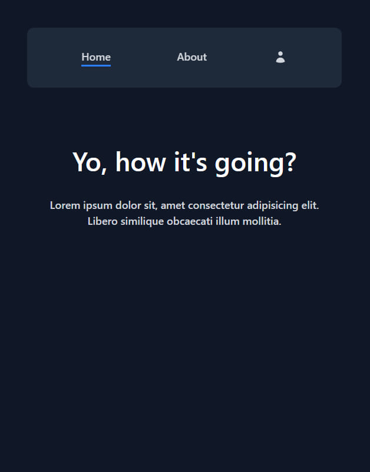
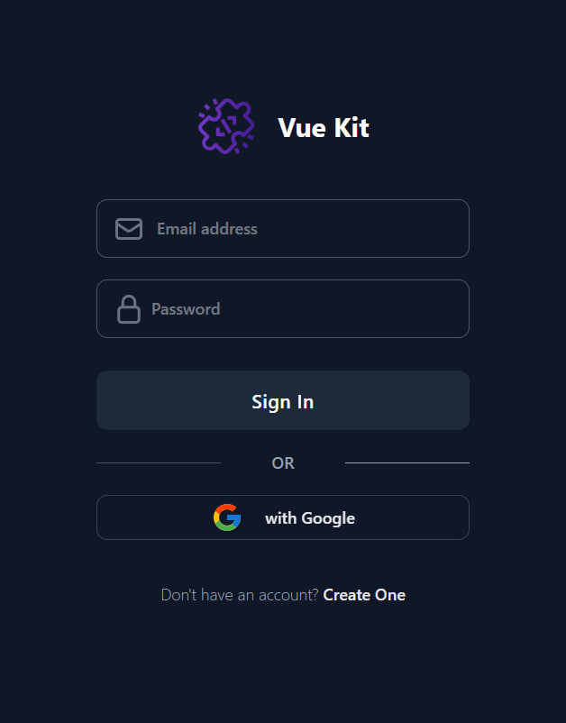

# Browser Extension Vue Kit

This template will help you get started developing a browser extension with Vue


## Features

- vue router
- auth pages
- google identity
- neat file structure
- state and fetcher
- tailwindcss

### UI Components

[Merakiui](https://merakiui.com)




## Project Setup

Install dependencies:

```sh
bun i
```

Fill up `.env`

U good to go 💗

### Commands

Run and observe a beauty

```sh
bun dev
```

Be ready to upload your extension

```sh
bun run build
```

Improve code quality

```sh
bun run check
```
